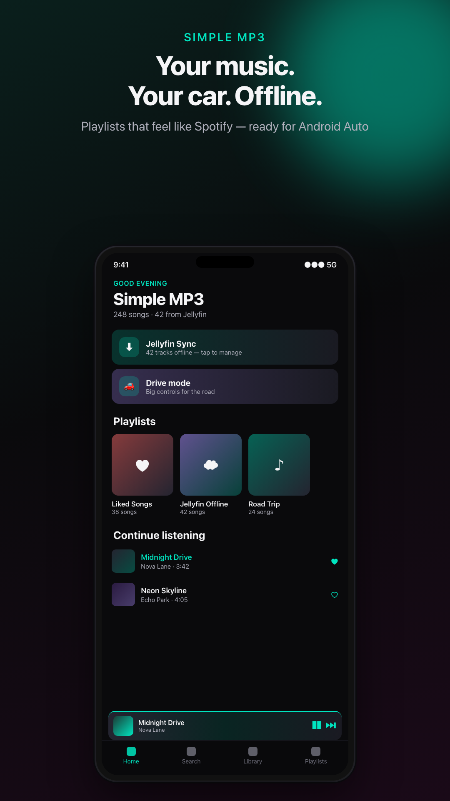
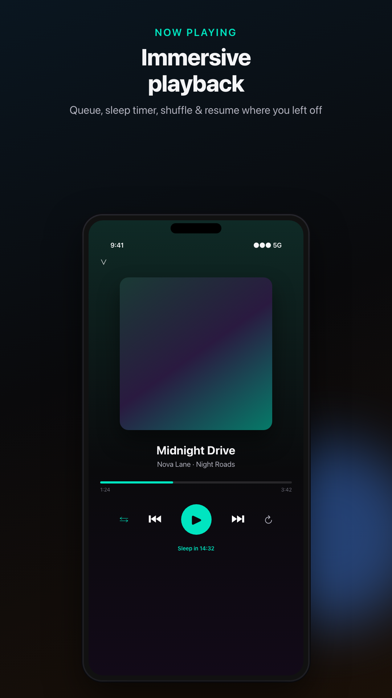
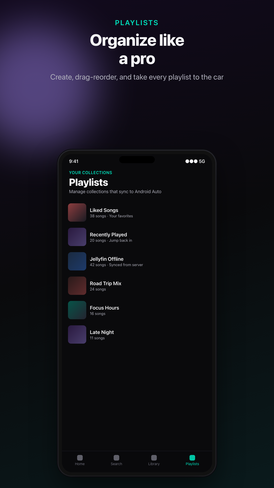
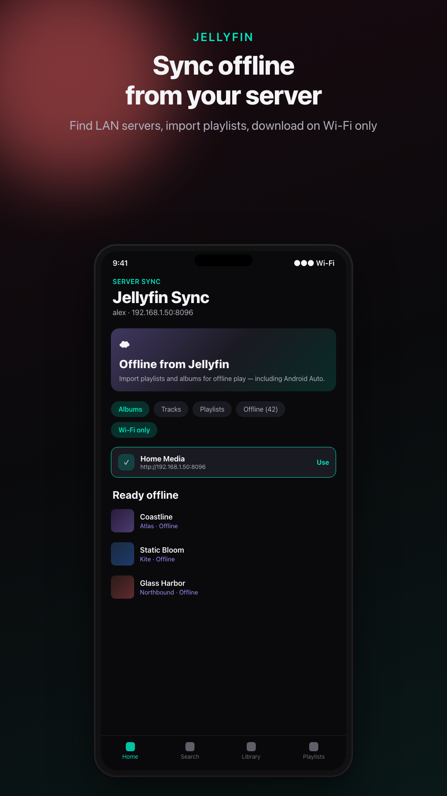

# Simple MP3

Local music player for Android with playlists, Jellyfin offline sync, and Android Auto.

<p align="center">
  
  &nbsp;
  
</p>

## Features

- **Local library** — scan and play audio already on your device (no streaming account)
- **Playlists** — create, reorder, Liked Songs, Recently Played
- **Android Auto** — full media browse tree and car controls via Media3
- **Jellyfin offline sync** — connect to your server, download for offline / Auto
- **YouTube → audio** — download and convert for offline listening
- **Quick Connect** — temporary LAN web portal to upload MP3s from a computer
- **Google Drive backup** — playlists/settings ZIP; optional app-owned offline media
- **Car-night UI** — dark Material 3 theme with teal accents
- **Drive mode** — big controls + auto-resume when Android Auto connects

## Screenshots

| Home | Playlists | Jellyfin |
|:----:|:---------:|:--------:|
|  |  |  |

More assets live under [`store-listing/`](store-listing/).

## Requirements

- Android Studio (Ladybug / recent stable recommended)
- JDK 17+
- Android device or emulator, **minSdk 29** (Android 10)

## Build

```bash
./gradlew assembleDebug
```

Install the debug APK from `app/build/outputs/apk/debug/`, or open the project in Android Studio and run the **app** configuration.

Release builds should be signed with your own keystore (do not commit signing keys or `.aab` / `.apk` files).

### Google Drive (optional)

Drive backup uses **`drive.file`** scope (only files this app creates). To enable Sign-In:

1. Create a project in [Google Cloud Console](https://console.cloud.google.com/).
2. Enable the **Google Drive API**.
3. Configure the OAuth consent screen (external/testing is fine for personal use).
4. Create an **Android** OAuth client ID:
   - Package name: `io.karpilabs.simplemp3`
   - SHA-1: debug or release keystore fingerprint  
     (`keytool -list -v -keystore ~/.android/debug.keystore` — password `android`)
5. Install the app, open **Tools → Google Drive**, and sign in.

Backups land in Drive under **Simple MP3 Backups** as `simplemp3-backup-*.zip` (metadata by default; optional offline media).

## Stack

- Kotlin · Jetpack Compose · Material 3
- Media3 (ExoPlayer + MediaLibraryService)
- Room · Hilt · DataStore · WorkManager
- OkHttp / Retrofit (Jellyfin)
- NewPipeExtractor + FFmpegKit (optional YouTube download)
- Google Sign-In + Drive REST API (backup)

## License

```
Copyright 2026 KarpiLabs LLC.

Licensed under the Apache License, Version 2.0.
See the LICENSE file for details.
```

Third-party notices for bundled libraries are in [`store-listing/listing/THIRD_PARTY_NOTICES.md`](store-listing/listing/THIRD_PARTY_NOTICES.md).
